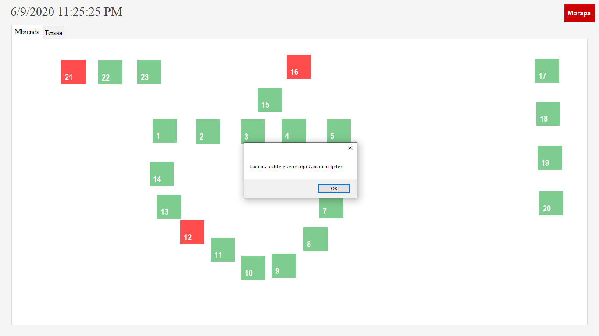

## Coffe_Managment_System

Ky aplikacion eshte krijuar per menaxhimin e kafiterive apo restoranteve qofshin ato te vogla apo te medha.

Rreth Aplikacionit
Aplikacioni eshte fullscren i krijuar per tu ekzekutuar ne windows 7 apo me larte, aplikacioni eshte i krijuar dhe mire i pershtatur per punen me touchscreen per perdorim sa me te leht dhe pa ngarkes per kamarierin.
Aplikacioni ndan userat 2 lloje:menaxherit i cili ka qasje dhe autorizim me te lart ne sistem dhe kamarieri i cili permes aplikacionit ben menaxhimin ditor te shitjeve.

**APLIKACIONI ESHTE LEHT I ADAPTUSHEM PER QDO KAFITERI**

__Funksionet e menaxherit__
1.  Menaxheri ben regjistrimin e kamariereve dhe monitorimin e tyre,
2.  Menaxheri ben ngarkimin e imazhit si logo e kafiteris e cila shfaqet ne faqen e pare te aplikacionit,
3.  Menaxheri eshte ne gjendje te pozicionoj tavolinat ne aplikacion sipas pozicionimit te tyre ne lokal,
4.  Menaxheri eshte ne gjendje te shtoj tavolina dhe te mirmbaj tarasen e lokalit gjate veres hapur dhe dimrit mbyllur,
5.  Menaxheri ben kontrollimin e invertarit(shtimin, fshirjen dhe ndryshimin e artikujv),
6.  Menaxheri nxjerr raporte mbi shitjet ditore, javore, mujore apo edhe mes dy datave te caktuar,
7.  Menaxheri eshte ne gjendje te nxjerr raporte edhe mbi shitjen dhe aktivitetin e kamarierit.

__Funksionet e kamarierit__
1.	Kamarieri eshte ne gjendje te zgjedhe qdo tavoline dhe te shtype pijet qe jane porositur ne ato tavolina,
2.	Kamarieri eshte ne gjendje te bej zbritje ne qmim me përqindje nëse ka festa te ndryshme.
3.	Kamarieri me rastin e marrjes se porosis ai mbyll tavolinen dhe ajo tavolin nuk eshte e qasshme nga kamarieret tjer deri sa te behet pagës dhe tavolina te hapet nga kamarieri përkatës.
4.	Kamarieri eshte gjendje te nxjerr fature per tavoline.

**Teknologjite e perdorura ne kete sistem jane C# per gjuhen programuse dhe SQL Server per bazen e te dhenave**

## Screnshotet e aplikacionit

